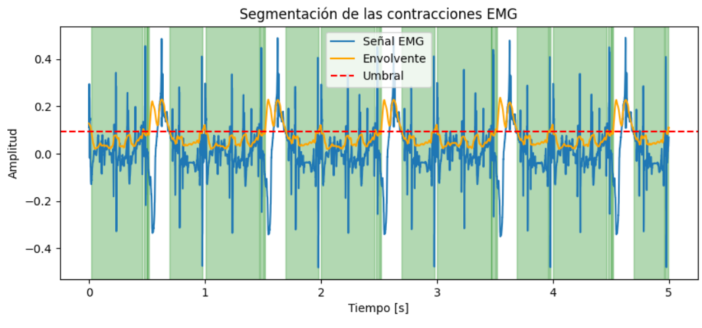

# Laboratorio-4-Procesamiento
En esta práctica de laboratorio se llevó a cabo el procesamiento de señales electromiográficas (EMG) con el fin de aplicar técnicas de filtrado y análisis espectral. A través de estas herramientas, se buscó detectar la aparición de fatiga muscular durante contracciones individuales y comparar el comportamiento entre una señal emulada y una señal real, considerando parámetros como la frecuencia media y la frecuencia mediana. Además, se emplearon herramientas computacionales para la segmentación y análisis de las señales biomédicas, permitiendo comprender de manera más profunda los cambios fisiológicos asociados a la actividad muscular y su representación en el dominio de la frecuencia.

## Importación de librerías
Para el desarrollo de esta práctica se instalaron las siguientes librerías:

```python
!pip install wfdb
import wfdb
import matplotlib.pyplot as plt
import numpy as np
import pandas as pd
import scipy.stats as stats
from google.colab import files
```
La librería `NumPy` fue fundamental para el manejo de los arreglos numéricos correspondientes a las señales electromiográficas, permitiendo realizar operaciones matemáticas, segmentar las contracciones y calcular parámetros estadísticos como la frecuencia media y mediana. La librería `matplotlib.pyplot` se empleó para la representación gráfica de las señales, tanto en el dominio del tiempo como en el dominio de la frecuencia, facilitando la visualización de los resultados obtenidos. Por su parte, `scipy.signal` proporcionó las herramientas necesarias para aplicar filtros digitales y realizar el análisis espectral mediante la función de densidad espectral de potencia. La librería `pandas` se utilizó para organizar los resultados en tablas, facilitando su análisis comparativo entre contracciones simuladas. Finalmente, `scipy.stats` permitió realizar cálculos estadísticos adicionales y análisis de tendencias relacionados con la fatiga muscular.

## PARTE A

<p align="center">


En la parte inicial del laboratorio se configuró el generador de señales biológicas en modo EMG, con la finalidad de generar aproximadamente cinco contracciones musculares voluntarias. Esta señal se adquirió y se almacenó en google colab (con ayuda del DAQ), para posteriormente graficarla de la siguiente manera: 

```python
data = np.loadtxt('/content/drive/MyDrive/senal_emg.txt')
t = data[0, :]   # primera fila = tiempo
emg = data[1, :] # segunda fila = amplitud

plt.plot(t, emg)
plt.title('Señal EMG')
plt.xlabel('Tiempo [s]')
plt.ylabel('Amplitud')
plt.show()
```
Mostrando la siguiente señal emulada:

<p align="center">


Con 1 Vpp y un rango de frecuencias de entre 50-100 Hz. Esta se muestreó con una frecuencia de muestreo de 1 kHz permitiendo capturar hasta ≈ 500 Hz (según el criterio de Nyquist), que cubre casi todo el espectro útil de una EMG (20 – 450 Hz).

Seguidamente, se realizó el análisis a partir de los siguientes parámetros:  

1. Se segmentó la señal obtenida en las cinco contracciones:

```python
# Calcular frecuencia de muestreo (fs) a partir del vector de tiempo
fs = 1 / (t[1] - t[0])

# --- 1. Calcular la envolvente (rectificación + suavizado) ---
env = uniform_filter1d(np.abs(emg), size=int(0.05 * fs))  # ventana de 50 ms

# --- 2. Definir un umbral ---
umbral = 0.4 * np.max(env)

# --- 3. Detectar zonas activas ---
activas = env > umbral
cambios = np.diff(activas.astype(int))
inicios = np.where(cambios == 1)[0]
finales = np.where(cambios == -1)[0]

# Asegurar que ambos vectores tengan la misma longitud
if finales.size < inicios.size:
    finales = np.append(finales, len(env)-1)

# --- 4. Visualizar la segmentación ---
plt.figure(figsize=(10,4))
plt.plot(t, emg, label='Señal EMG')
plt.plot(t, env, label='Envolvente', color='orange')
plt.axhline(umbral, color='r', linestyle='--', label='Umbral')
for i in range(len(inicios)):
    plt.axvspan(t[inicios[i]], t[finales[i]], color='green', alpha=0.3)
plt.title("Segmentación de las contracciones EMG")
plt.xlabel("Tiempo [s]")
plt.ylabel("Amplitud")
plt.legend()
plt.show()
```
Obteniendo como resultado: 

<p align="center">



