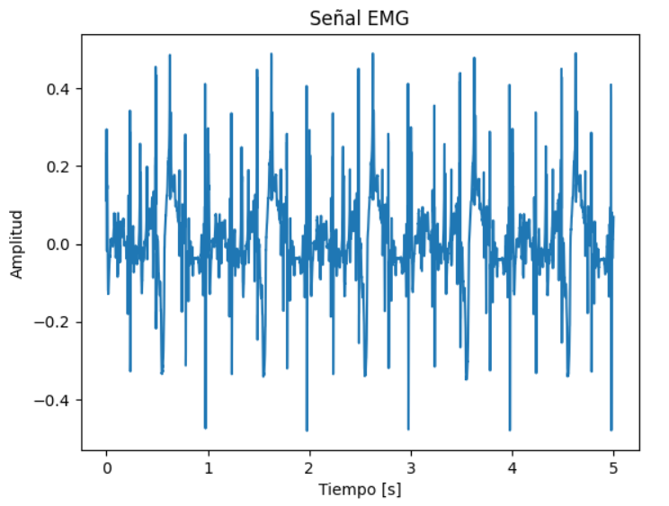

# Laboratorio-4-Procesamiento
En esta práctica de laboratorio se llevó a cabo el procesamiento de señales electromiográficas (EMG) con el fin de aplicar técnicas de filtrado y análisis espectral. A través de estas herramientas, se buscó detectar la aparición de fatiga muscular durante contracciones individuales y comparar el comportamiento entre una señal emulada y una señal real, considerando parámetros como la frecuencia media y la frecuencia mediana. Además, se emplearon herramientas computacionales para la segmentación y análisis de las señales biomédicas, permitiendo comprender de manera más profunda los cambios fisiológicos asociados a la actividad muscular y su representación en el dominio de la frecuencia.

## Importación de librerías
Para el desarrollo de esta práctica se instalaron las siguientes librerías:

```python
!pip install wfdb
import wfdb
import matplotlib.pyplot as plt
import numpy as np
import pandas as pd
import scipy.stats as stats
from google.colab import files
```
La librería `NumPy` fue fundamental para el manejo de los arreglos numéricos correspondientes a las señales electromiográficas, permitiendo realizar operaciones matemáticas, segmentar las contracciones y calcular parámetros estadísticos como la frecuencia media y mediana. La librería `matplotlib.pyplot` se empleó para la representación gráfica de las señales, tanto en el dominio del tiempo como en el dominio de la frecuencia, facilitando la visualización de los resultados obtenidos. Por su parte, `scipy.signal` proporcionó las herramientas necesarias para aplicar filtros digitales y realizar el análisis espectral mediante la función de densidad espectral de potencia. La librería `pandas` se utilizó para organizar los resultados en tablas, facilitando su análisis comparativo entre contracciones simuladas. Finalmente, `scipy.stats` permitió realizar cálculos estadísticos adicionales y análisis de tendencias relacionados con la fatiga muscular.

## PARTE A

<p align="center">


<p align="center">

